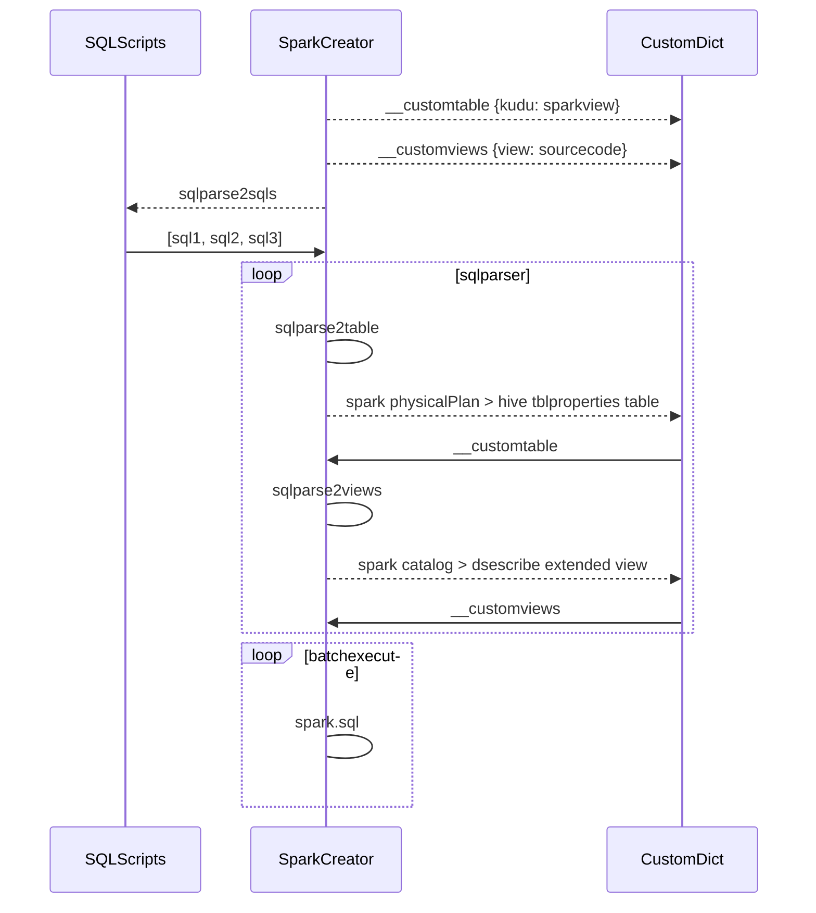

<h1 align="center">Sparktool</h1>

[TOC]

<font face="Calibri">

### Problem
- spark can not execute whole sql scripts one time, only execute sql one by one.
- spark can not read kudu table directly. If a kudu table was used in a view, it will throw error.

### Idea
[hasty draft](https://github.com/renyumm/sparktool/blob/master/Sparkcreator.png)

### Solution


### Guide
#### Install
```
pip install --user --upgrade sparktool
pip2 install --user --upgrade sparktool
```

#### Connection 
##### Global Method
modify /home/user/.sparktool.json

##### Switch User
```
import sparktool as st
st.switch_keytab('admin@EXAMPLE.COM', keytabpath)
```

##### Connect to Hue [For HCC]
```
import sparktool as st
st.switch_huetab(username, password)
```

#### Use
##### SparkCreator
```
[in]
import sparktool as st
ss = st.SparkCreator()
sql = '''
select 1;
select
    cc.skp_client
from
    owner_ogg.ft_ccase_2_ccase_ad cc
    join owner_ogg.clt_ccase_2_ccase_relation re
      on cc.skp_ccase_2_ccase_relation = re.skp_ccase_2_ccase_relation
     and re.code_ccase_relation = 'FIRST_POS' 
limit 1
;

ss.batch_excutesql(sql)

[out]
Tranform Table:
+--------------------------------------+--------------------------------------+--------------+
|             Origin Table             |            Temporary View            | If Transform |
+--------------------------------------+--------------------------------------+--------------+
|    OWNER_OGG.FT_CCASE_2_CCASE_AD     |    owner_ogg_ft_ccase_2_ccase_ad     |     New      |
| OWNER_OGG.CLT_CCASE_2_CCASE_RELATION | owner_ogg_clt_ccase_2_ccase_relation |     New      |
+--------------------------------------+--------------------------------------+--------------+
Excute Progress: 2/2
DataFrame[skp_client: decimal(38,0)]

[param]
- ifview: whether there is a view in sql
- ifbatchre: b,c,d,e,f = ss.batch_excutesql(sql, ifview=True, ifbatchre=True)
```
  
##### HueCreator
```
[in]
from sparktool import HueCreator
aa = HueCreator()
aa.hue_printlist()

[out]
+--------+-------------------------+----------------------------+-------------------+
|   id   |           name          |        description         |   last_modified   |
+--------+-------------------------+----------------------------+-------------------+
| 691124 |     aaaaaaaaaaaaaaa     |                            | 2020-01-17T17:41Z |
| 686849 |           hcp           |                            | 2020-01-17T10:32Z |
| 675390 |           aaaa          |                            | 2020-01-16T11:05Z |
| 681235 |          ttttt          |                            | 2020-01-15T09:41Z |
| 676699 |           aaaa          |                            | 2020-01-14T09:53Z |
+--------+-------------------------+----------------------------+-------------------+

[in]
aa.hue_getscript('hcp')
aa.hue_setscript(sql, name='hcp', uuid=None)
```
</font>